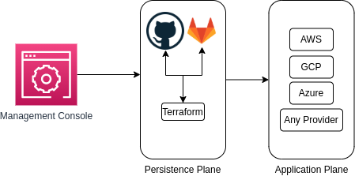

# Service-Console
UX friendly Cloud UI for all Clouds (AWS, GCP, Azure)

Open Source Cloud Console

Consoles as of today is closed sourced, even though they do use publicly available API of cloud services. We're building the next great Cloud Console, and it starts here. Right now this is only a short intro of what the service could be. And while there are some alternatives this one focuses on application services connecting the cloud resources together. You'll get an application first solution rather than cloud infrastructure first which isn't very useful.

## Vision
**an application-service first UI that automatically bidirectionally converts to IaC**
For example get Terraform code out, if you wanted it. Have the diffs committed to github for persistence. Every user interaction is saved, so it's a native "console-recorder". This is a application service first, that means you see your applications, not your cloud provider's apps. We know those aren't valuable, so why are they there. Tags in AWS are the first class notion here.

### How it compares
* It isn't terraform or just IaC, because the UI gives your engineers a high usability UI to interact, track, and monitor your services using links to the right cloud native tools
* It isn't just generation of code, it runs it to, queries it
* It'll track any change made in the UI directly to the right IaC application stack, or generate a new one on the fly.
* There's no need to export architecture or use something like Former2 to export. All the resources are already saved.

## Standard full service patterns
Quickly deploy an HA application without needing to understand all the AWS services that go into it. The generated code contains all the necessary resources, but at the end of the day your application and all the necessary tools to monitor it will be automatically available. Navigating from DynamoDB to Lambda, to CloudWatch, to Insights or whatever you need to, is right away available no need to save tons of service bookmarks, and one for each service at that.

## Suggested high level architecture

### Services supported
* GitHub/GitLab for commits to infrastructure as it changes
* Terraform as IaC state
* Cloud provider
* Any additional service using terraform providers

Curious about more details, join our community:
* [Slack Workspace](https://bit.ly/authress-community)
* [Discord Server](https://discord.gg/TSaFbA6)
